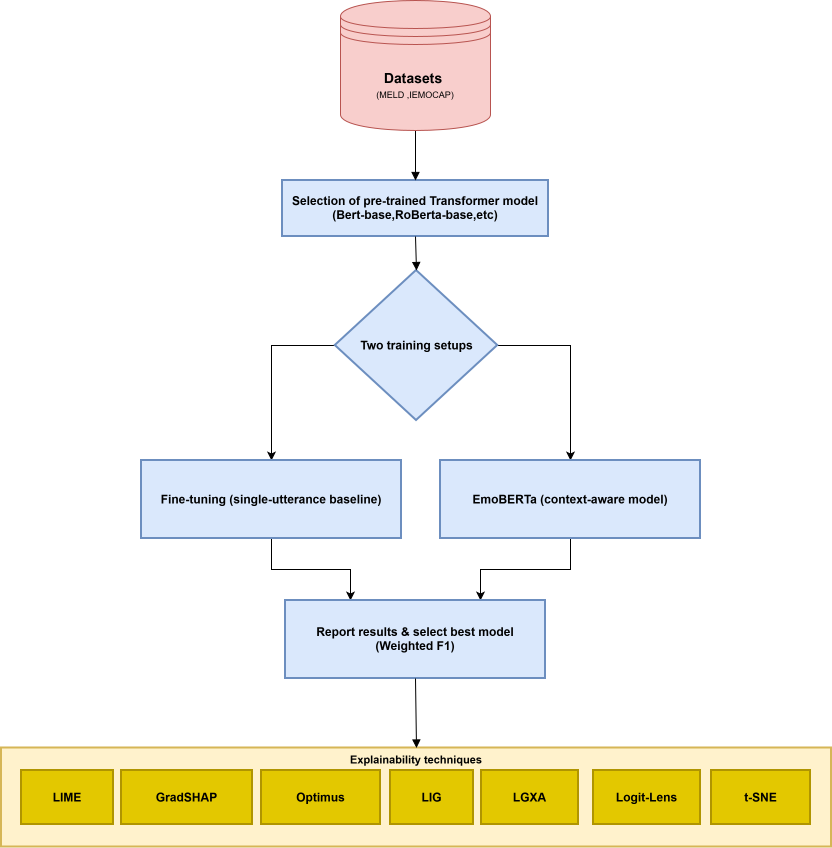

# Emotion Recognition in Conversations (ERC) with Transformers & Explainability

This repository contains code and experiments for Emotion Recognition in Conversations (ERC) using Transformer-based text encoders and a multi-level explainability pipeline. We study ERC on MELD and IEMOCAP, comparing single-utterance emotion classifiers (fine-tuned BERT/DistilBERT/RoBERTa baselines) against a context-aware variant (EmoBERTa-style) that incorporates dialogue history and speaker cues by constructing contextualized inputs. Beyond performance (e.g., weighted F1 on test splits), we provide interpretability analyses at multiple granularities, including utterance-level explanations , corpus-level token importance (e.g., GradSHAP-style global profiles), and representation/geometry diagnostics (layer-wise analyses, logit-lens trends, and CLS embedding visualizations with clustering metrics). The goal is to quantify how context and fine-tuning affect both accuracy and the evidence used by the model in conversational settings.

## Block Diagram of the Pipeline



---

## What’s inside (high level)

**Models**
- **Single-utterance baselines (base encoders):** DistilBERT-base, BERT-base, RoBERTa-base (full fine-tuning, target utterance only).
- **RoBERTa-large single-utterance:** the same recipe on RoBERTa-large, used to isolate the effect of context from backbone size.
- **Context-aware model (EmoBERTa-style):** **RoBERTa-large** with speaker-aware, context-window input construction (double `</s></s>` bracketing of the target utterance under a 512-token budget). Ablations over context direction (past / future / both) and class-imbalance losses are included.

**Datasets (text transcripts)**
- **MELD** (Ekman-7) and **IEMOCAP** (6-way). Raw and context-constructed CSVs are under `Datasets/`.

**Evaluation**
- Main metric: **Weighted F1** (suited to imbalanced class distributions); macro-F1 and accuracy reported alongside.
- Diagnostics: **confusion matrices** (including per-epoch tracking).

**Explainability**
- **Utterance- & corpus-level (local/global):** LIME, GradSHAP (Captum), and **Optimus** attention-derived token importance (three variants: Baseline (A), Batch, Prime), plus layer-wise relevance (LIG + LGXA) and Logit-Lens trajectories in the notebooks.
- **Quantitative faithfulness (ERASER-style):** comprehensiveness, sufficiency, AOPC, deletion/insertion AUC, logit-drop, vs. a Random baseline (reviewer note 5).
- **Explanation agreement:** cross-method rank correlation, top-k overlap, cross-seed stability, per-class variance (reviewer note 7).
- **Representation geometry:** original-space cluster metrics (silhouette, Davies–Bouldin, Calinski–Harabasz, Dunn, k-NN probe) with PCA / UMAP / multi-seed t-SNE robustness checks (reviewer note 10).

---

## Repository structure
```text
erc_paths.py                  # single source of truth for paths + GPU selection (see "Setup")
requirements.txt              # Python dependencies (Optimus is vendored, not pip-installed)
LICENSE                       # MIT (vendored Optimus keeps its own license)

Datasets/
├── Meld/                     # raw MELD (*_sent_emo.csv) + context-constructed CSVs
└── IEMOCAP/                  # raw IEMOCAP + context-constructed CSVs

Models/                       # training scripts (RoBERTa-large) + shared helpers
├── Emoberta_meld.py          # context-aware EmoBERTa (MELD, both-context) — main model
├── Emoberta_iemocap.py       # context-aware EmoBERTa (IEMOCAP, both-context)
├── Emoberta_{meld,iemocap}_{past_only,future_only}.py   # context-direction ablations
├── Emoberta_{meld,iemocap}_loss.py                       # class-imbalance loss ablations
├── roberta_large_single.py   # single-utterance RoBERTa-large (no context) — context isolation
├── iemocap_context.py        # shared IEMOCAP context builder
├── repro_utils.py            # writes repro_report.{json,md} per run
└── *.ipynb                   # original interactive/Colab notebooks (base-encoder baselines, etc.)

Explainability/               # explainers, faithfulness, agreement, geometry, plots
├── faithfulness_eval.py      # ERASER-style faithfulness (GradSHAP/LIME/Optimus/Random)
├── optimus_fast_ftp.py       # optional vectorised FTP speedup for Optimus
├── explanation_agreement*.py # cross-method agreement (rank corr, top-k, stability)
├── embedding_geometry.py / epoch_geometry.py / embedding_plots.py   # representation geometry
├── optimus_*_plots.py / paper_plots_from_scores.py / explanation_figures.py   # figures
├── build_note7_context.py / build_reviewer_response.py              # reviewer-response builders
└── *.ipynb                   # original interactive/Colab explanation notebooks

third_party/optimus/          # VENDORED patched Optimus library (+ LICENCE, PATCHES.md)
code_ocean/                   # lightweight capsule that reproduces figures/tables from artifacts
erc_revision_figures/         # generated figures for the revised edition
```

### About the dataset CSVs
- `Datasets/Meld/` and `Datasets/IEMOCAP/` hold the **raw** transcripts and the
  **context-constructed** CSVs (the exact inputs the models train on).
- The context-constructed CSVs are also regenerated on the fly by the `Models/Emoberta_*.py`
  scripts, so they can be rebuilt from the raw CSVs.

---

## Setup

```bash
python -m venv .venv && source .venv/bin/activate
pip install -U pip
pip install -r requirements.txt
```

**Paths & GPU.** All scripts resolve their locations through `erc_paths.py`, which defaults to
repo-relative folders and can be overridden with environment variables — no path editing needed:

| Variable | Default | Meaning |
|---|---|---|
| `ERC_DATA` | `./Datasets` | dataset CSVs |
| `ERC_CHECKPOINTS` | `./checkpoints` | trained models + saved attributions/embeddings |
| `ERC_RESULTS` | `./results` | generated figures/tables |
| `OPTIMUS_REPO` | `./third_party/optimus` | vendored Optimus library |
| `GPU` | `0` | which single GPU to pin (`GPU=1 python …`) |

> Notes:
> - Tested with **Python 3.10**, `torch==2.5.1`, `transformers` 4.46.3 (explainers/Optimus) — training
>   was run with `transformers==4.57.1`; both work, the split is only because the Optimus stack pins an
>   older `transformers`/`numpy<2`.
> - **Optimus is vendored** under `third_party/optimus/` (a patched, non-pip fork — see its
>   `PATCHES.md`); only the `faithfulness_eval.py` / `optimus_paper_curves.py` Optimus paths use it.
> - A **GPU** is recommended for training and for running the explainers; the figure/table
>   reproduction (see *Code Ocean* below) is CPU-only.
> - Hardware used: **NVIDIA A100-SXM4-40GB** (training + explainers).
---

## Running the code

All scripts are run directly with `python`; select the GPU with `GPU=<idx>` and (where relevant)
the dataset with `DATASET=<meld|iemocap>`.

```bash
# Context-aware EmoBERTa (RoBERTa-large, both-context) — the main models
GPU=0 python Models/Emoberta_meld.py
GPU=0 python Models/Emoberta_iemocap.py

# Ablations: context direction (past/future) and class-imbalance losses
GPU=0 python Models/Emoberta_meld_past_only.py
GPU=0 LOSS_TYPE=focal python Models/Emoberta_meld_loss.py

# Single-utterance RoBERTa-large (no context) — isolates the contribution of context
GPU=0 DATASET=meld    python Models/roberta_large_single.py
GPU=0 DATASET=iemocap python Models/roberta_large_single.py

# Quantitative faithfulness (note 5) — saves attributions for the agreement/plots too
GPU=0 python Explainability/faithfulness_eval.py \
    --dataset meld --model context \
    --explainers gradshap,lime,optimus,random --save_scores

# Explanation agreement (note 7) and figures (from the saved attributions, no GPU)
python Explainability/explanation_agreement_matrix.py
python Explainability/explanation_figures.py
python Explainability/paper_plots_from_scores.py       # Optimus corpus curves + Coverage@10%
```

To reproduce **only the figures/tables from the already-saved artifacts** (CPU, minutes), use the
Code Ocean capsule described below.

## Training & evaluation

### Single-utterance fine-tuning
The single-utterance baselines fine-tune a pretrained encoder with a classification head using the **target utterance only**.

Typical hyperparameters used in this project:
- **Epochs:** 5  
- **Learning rate:**  
  - BERT / DistilBERT: **3e-5**  
  - RoBERTa: **2e-5**
- **Metric:** Weighted F1 on the test split  
- **Reporting:** mean over **5 random seeds**


### Context-aware (EmoBERTa-style)
The context-aware model builds a **speaker-aware input sequence** by expanding around the target utterance with past/future turns under a token limit, and then fine-tunes RoBERTa on this constructed input.
Typical hyperparameters used in this project:
- **Epochs:** 6  
- **Learning rate:**  
  - LR: **2e-5**
- **Metric:** Weighted F1 on the test split  
- **Reporting:** mean over **5 random seeds**

- Input: context-constructed text (In order to construct on-the-fly the context-constructed dataset run the Models/Emoberta_X.ipynb )

We report the mean weighted F1 over 5 random seeds.

  | Model                 | Dataset | Weighted F1 |
  | --------------------- | ------- | ----------: |
  | Emoberta              | MELD    |     0.63905 |
  | Emoberta              | IEMOCAP |    0.639297 |
  | Fine Tuned RoBERTa    | MELD    |    0.626903 |
  | Fine Tuned RoBERTa    | IEMOCAP |    0.547492 |
  | Fine Tuned BERT       | MELD    |    0.623891 |
  | Fine Tuned BERT       | IEMOCAP |    0.545502 |
  | Fine Tuned DistilBERT | MELD    |    0.612383 |
  | Fine Tuned DistilBERT | IEMOCAP |    0.527937 |

### RoBERTa-large EmoBERTa — context ablation (past / future / both)

EmoBERTa-faithful reimplementation on **RoBERTa-large** using the double `</s></s>` `[SEP]`
(3-segment `<s> past </s></s> current </s></s> future </s>`) and speaker-prepended utterances.
Scores are **test-set mean ± std over 5 seeds** (42–46). IEMOCAP uses the standard split
(Sessions 1–4 train/val, Session 5 test; 1,622 six-class test utterances). The rightmost
column is the corresponding EmoBERTa paper number (weighted-F1, %) for reference.

| Dataset | Context | Weighted-F1 (%) | Macro-F1 (%) | Accuracy (%) | EmoBERTa (paper) |
| ------- | ---------------- | :-------------: | :----------: | :----------: | :--------------: |
| MELD    | Both (past+future) | 66.50 ± 0.24 | 49.76 ± 0.66 | 67.15 ± 0.37 | 65.61 |
| MELD    | Past-only          | 66.47 ± 0.43 | 50.03 ± 0.75 | 67.03 ± 0.41 | 64.55 |
| MELD    | Future-only        | 65.10 ± 0.14 | 48.39 ± 1.02 | 65.98 ± 0.09 | — |
| IEMOCAP | Both (past+future) | 65.16 ± 1.44 | 63.12 ± 1.49 | 65.27 ± 1.48 | 67.42 |
| IEMOCAP | Past-only          | 66.09 ± 0.77 | 64.21 ± 1.35 | 66.13 ± 0.65 | 68.57 |
| IEMOCAP | Future-only        | 63.00 ± 1.31 | 60.79 ± 1.61 | 63.02 ± 1.13 | — |

**Notes.**
- The context-direction ablation reproduces EmoBERTa's qualitative findings: **future-only is
  weakest on both datasets**, and on **IEMOCAP past-only ≥ both** (66.09 vs 65.16) because long
  IEMOCAP dialogues saturate the 512-token budget (~8.3% of both-context examples hit the cap,
  vs ~2.8% for past-only), so adding future context costs more via truncation than it adds.
- MELD is at/slightly above the paper; IEMOCAP is ~2–2.5 pts below, within IEMOCAP's known
  reproduction variance (single-session, 1,622-utterance test set). These are a **reimplementation
  consistent with EmoBERTa within variance**, not an exact reproduction.
- Reproducibility artifacts (preprocessing, context-length/truncation stats, hardware, runtime)
  are emitted per run as `repro_report.{json,md}`.

### Single-utterance RoBERTa-large (no context) — isolating the contribution of context

To measure how much of the performance comes from **context** rather than from the larger
backbone, we fine-tune the *same* RoBERTa-large on the **target utterance only** — no context,
no speaker prefix — following the single-utterance baseline recipe
(`Models/roberta_large_single.py`: 5 epochs, label smoothing 0.1, batch 16, best-on-weighted-F1).
The data is derived from the context CSVs by taking the segment between the `</s></s>` markers,
so the **splits, rows and labels are identical** to the context-aware model — the *only*
difference is that context is removed.

Scores are **test-set mean ± std over 5 seeds** (42–46), as in the tables above.

| Dataset | Model (RoBERTa-large) | Weighted-F1 (%) | Macro-F1 (%) | Accuracy (%) | Δ Weighted-F1 |
| ------- | --------------------- | :-------------: | :----------: | :----------: | :-----------: |
| MELD    | Single-utterance (no context) | 63.93 ± 0.29 | 47.65 ± 0.89 | 65.17 ± 0.54 | — |
| MELD    | **Context-aware (both)**      | **66.50 ± 0.24** | **49.76 ± 0.66** | **67.15 ± 0.37** | **+2.57** |
| IEMOCAP | Single-utterance (no context) | 55.98 ± 0.60 | 53.79 ± 0.67 | 56.37 ± 0.65 | — |
| IEMOCAP | **Context-aware (both)**      | **65.16 ± 1.44** | **63.12 ± 1.49** | **65.27 ± 1.48** | **+9.18** |

**Findings.**
- **Context is what carries the gain, not the backbone.** With the backbone, data, splits and
  recipe held fixed, adding conversational context is worth **+2.57** weighted-F1 on MELD and
  **+9.18** on IEMOCAP.
- The effect is **far larger on IEMOCAP**, consistent with its long, emotionally-continuous
  dyadic dialogues (emotion persists across turns), whereas MELD's short, rapidly-switching
  multi-party scenes carry more of the signal inside the target utterance itself.
- The single-utterance RoBERTa-large also improves on the RoBERTa-**base** single-utterance
  baselines above (MELD 62.69 → 63.93; IEMOCAP 54.75 → 55.98), confirming the gains in the
  context table are *not* merely a backbone-size effect.
- The **representation geometry independently corroborates this** (see the CLS-embedding
  section): in the original 1024-d space, adding context raises the k-NN probe by only
  +2.5 pts on MELD but **+20.9 pts on IEMOCAP** — the same asymmetry, measured a completely
  different way.

### Class-imbalance loss ablation (MELD, both-context)

MELD is severely imbalanced (`neutral` ≈ 47% of the training data vs `fear`/`disgust`
≈ 2.7% each), which is why the plain cross-entropy model has a much lower **macro-F1**
(all classes weighted equally) than **weighted-F1**. We compare three standard
imbalance-aware losses against the plain-CE baseline, on the RoBERTa-large both-context
model. Each loss is tuned independently (Optuna LR search maximizing validation
weighted-F1) and reported as test mean ± std over 5 seeds. Δ is the change in macro-F1
vs the plain-CE baseline.

| Loss | Weighted-F1 (%) | Macro-F1 (%) | Accuracy (%) | Δ Macro-F1 |
| ------------------- | :-------------: | :----------: | :----------: | :--------: |
| Plain CE (baseline) | 66.50 ± 0.24 | 49.76 ± 0.66 | 67.15 ± 0.37 | — |
| Weighted CE         | 64.79 ± 0.43 | 50.72 ± 0.90 | 64.02 ± 0.66 | +0.96 |
| Focal (γ=2)         | 65.54 ± 0.60 | **51.96 ± 0.88** | 65.03 ± 0.63 | **+2.19** |
| Class-balanced      | **66.24 ± 0.79** | 51.43 ± 0.87 | **66.20 ± 0.83** | +1.67 |

**What each method is** (all implemented by overriding `Trainer.compute_loss`; see
`Models/Emoberta_meld_loss.py`, selected via the `LOSS_TYPE` env var):

- **Plain CE** — standard cross-entropy; every example weighted equally, so the model
  is dominated by the majority `neutral` class.
- **Weighted CE** (`weighted_ce`) — cross-entropy scaled per class by *balanced
  inverse-frequency* weights (`sklearn` `compute_class_weight("balanced")`): rare-class
  errors count ~2.3×, `neutral` ~0.13×. Simple but aggressive.
- **Focal loss** (`focal`, γ=2) — down-weights *easy* examples by `(1 − p_t)^γ` so training
  concentrates on hard/rare ones, with the class weights applied as a separate α term.
  Dynamic and per-example.
- **Class-balanced** (`class_balanced`) — Cui et al. (2019) "effective number of samples"
  weighting (`(1−β)/(1−β^n)`, β=0.999); a *gentler* reweighting than inverse-frequency
  (`neutral` 0.45, `fear`/`disgust` ~1.9 vs weighted-CE's 0.13 / 2.3).

**Findings.**
- All three imbalance losses **improve macro-F1** over plain CE (rare classes recover),
  at some cost to weighted-F1/accuracy — the expected imbalance trade-off.
- **Focal** gives the **largest rare-class gain** (macro-F1 +2.19).
- **Class-balanced** gives the **best trade-off**: +1.67 macro-F1 for almost no drop in
  weighted-F1 (−0.26) or accuracy (−0.95), because its gentler weights avoid over-correcting.
- **Weighted CE** over-corrects — the smallest macro gain (+0.96) for the largest cost
  (weighted-F1 −1.71, accuracy −3.13).

---

## Quantitative faithfulness of the explanations (reviewer note 5)

ERASER-style perturbation evaluation over the **full test corpus** (`Explainability/faithfulness_eval.py`).
For each example we take the model's predicted class, rank tokens by the explainer's attribution,
replace the top-k with `<mask>`, and measure the change in predicted-class probability / logit.
Metrics: **comprehensiveness** (↑; drop when top-k are removed), **sufficiency** (↓; drop when only
top-k are kept), **AOPC** (↑; area over the deletion curve), **deletion-AUC** (↓) / **insertion-AUC**
(↑), and **logit-drop** (↑). A **Random** attribution baseline is run through the identical pipeline —
an explainer is only faithful if it beats Random. All metrics are averaged over the corpus.

Explainers: **GradSHAP** (Captum), **LIME**, and **Optimus** in its three variants — *baseline* (fixed
mean-mean-`From` attention config), *Batch* (`max_across`; one config chosen on a 500-utterance
calibration set), and *Prime* (`max_per_instance`; best config chosen per example). `*` marks Optimus
Batch, whose config is selected by Optimus's own FTP criterion.

#### Table F1 — Single fine-tuned model (target utterance only, ~14 tokens), full corpus

**MELD — single fine-tuned, single utterances (n = 2600)**

| Explainer | Compr. ↑ | Suff. ↓ | AOPC ↑ | Del-AUC ↓ | Ins-AUC ↑ | Logit-drop ↑ | Beats Random |
|---|---|---|---|---|---|---|---|
| GradSHAP | 0.158 | 0.149 | 0.230 | 0.518 | 0.655 | 0.640 | **6/6** |
| LIME | 0.154 | 0.175 | 0.247 | 0.501 | 0.665 | 0.610 | **6/6** |
| Optimus — baseline (A) | 0.122 | 0.158 | 0.204 | 0.544 | 0.631 | 0.498 | **6/6** |
| Optimus — Prime | 0.117 | 0.178 | 0.202 | 0.547 | 0.624 | 0.473 | **6/6** |
| Optimus — Batch * | 0.040 | 0.239 | 0.125 | 0.623 | 0.563 | 0.143 | 0/6 |
| Random (baseline) | 0.079 | 0.212 | 0.167 | 0.581 | 0.593 | 0.298 | — |

**IEMOCAP — single fine-tuned, single utterances (n = 1616)**

| Explainer | Compr. ↑ | Suff. ↓ | AOPC ↑ | Del-AUC ↓ | Ins-AUC ↑ | Logit-drop ↑ | Beats Random |
|---|---|---|---|---|---|---|---|
| GradSHAP | 0.122 | 0.300 | 0.270 | 0.408 | 0.499 | 0.520 | **6/6** |
| LIME | 0.175 | 0.265 | 0.314 | 0.364 | 0.546 | 0.730 | **6/6** |
| Optimus — baseline (A) | 0.054 | 0.347 | 0.210 | 0.468 | 0.441 | 0.211 | 0/6 |
| Optimus — Prime | 0.060 | 0.343 | 0.216 | 0.462 | 0.447 | 0.237 | 0/6 |
| Optimus — Batch * | 0.046 | 0.341 | 0.202 | 0.476 | 0.453 | 0.196 | 1/6 |
| Random (baseline) | 0.078 | 0.337 | 0.219 | 0.459 | 0.452 | 0.319 | — |

#### Table F2 — Context-aware EmoBERTa (full constructed context), full corpus

*(Optimus — Prime on the context model is computed on a class-stratified subset and will be added; the other explainers are full-corpus.)*

**MELD — context-aware, full context (n = 2610)**

| Explainer | Compr. ↑ | Suff. ↓ | AOPC ↑ | Del-AUC ↓ | Ins-AUC ↑ | Logit-drop ↑ | Beats Random |
|---|---|---|---|---|---|---|---|
| GradSHAP | 0.252 | 0.318 | 0.401 | 0.417 | 0.662 | 1.146 | **6/6** |
| LIME | 0.133 | 0.388 | 0.311 | 0.507 | 0.559 | 0.583 | 5/6 |
| Optimus — baseline (A) | 0.182 | 0.339 | 0.375 | 0.443 | 0.562 | 0.906 | **6/6** |
| Optimus — Batch * | 0.107 | 0.417 | 0.289 | 0.528 | 0.508 | 0.495 | 4/6 |
| Random (baseline) | 0.076 | 0.399 | 0.257 | 0.561 | 0.560 | 0.292 | — |

**IEMOCAP — context-aware, full context (n = 1622)**

| Explainer | Compr. ↑ | Suff. ↓ | AOPC ↑ | Del-AUC ↓ | Ins-AUC ↑ | Logit-drop ↑ | Beats Random |
|---|---|---|---|---|---|---|---|
| GradSHAP | 0.248 | 0.527 | 0.502 | 0.387 | 0.628 | 1.246 | **6/6** |
| LIME | 0.111 | 0.581 | 0.381 | 0.508 | 0.537 | 0.550 | **6/6** |
| Optimus — baseline (A) | 0.250 | 0.519 | 0.554 | 0.334 | 0.606 | 1.437 | **6/6** |
| Optimus — Batch * | 0.129 | 0.614 | 0.400 | 0.489 | 0.494 | 0.678 | 4/6 |
| Random (baseline) | 0.076 | 0.591 | 0.360 | 0.528 | 0.529 | 0.377 | — |

**Findings.**
- **GradSHAP and LIME are robustly faithful** — both beat Random on all six metrics, on both
  datasets, for both the single-utterance and context-aware models.
- **Attention-based Optimus is length-dependent.** On short single utterances (~14 tokens) Optimus
  fails on IEMOCAP (0/6 vs Random) but works on MELD; on the **long constructed contexts**
  (~214 tokens MELD, ~498 IEMOCAP) it recovers to **6/6 on both**, and on IEMOCAP context it *ties*
  GradSHAP (comprehensiveness 0.250 vs 0.248) and beats it on AOPC and logit-drop. Attention-derived
  explanation becomes competitive only when there is sufficient context to attend over — consistent
  with the erasure-based analysis of Serrano & Smith (2019) and the qualified position of Wiegreffe &
  Pinter (2019).
- **Optimus Prime ≈ baseline** despite selecting a configuration per example (~1.7k evaluations each):
  the expensive per-instance search yields no measurable faithfulness gain here.
- **Optimus Batch is the weakest variant** (0–4/6): the configuration chosen by Optimus's internal
  FTP criterion is not the most faithful one under ERASER metrics — an instance of faithfulness
  criteria not being interchangeable (Jacovi & Goldberg, 2020).
- The metrics use `<mask>` perturbation (an in-distribution variant of ERASER's deletion) and the
  predicted class; special tokens are never perturbed.


---

## Explanation agreement (reviewer note 7)

Using the raw per-token attributions saved during the faithfulness run
(`Explainability/explanation_agreement_matrix.py` + `explanation_agreement.py`), we quantify
how much the explanation methods agree — over the real word tokens (embedded `</s></s>`
segment markers excluded). Top-k overlap uses a **length-adaptive top-20%** (a fixed k=10
would be ~70% of a 14-token utterance but ~2% of a 500-token context — not comparable).
**Random** is included as a method: it is the chance-agreement level.

**Cross-method agreement — Spearman ρ / top-20% Jaccard (key pairs).**

| Model / dataset | GradSHAP↔LIME | GradSHAP↔Optimus | LIME↔Optimus |
| --------------- | :-----------: | :--------------: | :----------: |
| Single-utt · MELD    | +0.08 / 0.23 | +0.02 / 0.20 | +0.09 / 0.28 |
| Single-utt · IEMOCAP | +0.06 / 0.19 | +0.00 / 0.20 | +0.05 / 0.24 |
| Context · MELD       | +0.00 / 0.11 | +0.01 / 0.15 | +0.01 / 0.12 |
| Context · IEMOCAP    | +0.00 / 0.12 | +0.06 / 0.17 | +0.02 / 0.14 |

*(The full 6×6 Spearman and Jaccard matrices, including all Optimus variants and the Random
column, are in `checkpoints/agreement/agreement_matrix.md`.)*

**Attribution stability across the 5 fine-tuning seeds (context model, Spearman ρ).**

| Method | MELD | IEMOCAP |
| ------ | :--: | :-----: |
| GradSHAP | 0.13 | 0.16 |
| LIME     | **0.54** | **0.44** |

**Findings.**
- **The methods barely agree.** Rank correlation is near zero for every pair, on both models
  and datasets — even though GradSHAP and LIME are both individually *faithful* (they each beat
  Random on all six metrics above). This is the "disagreement problem" (Krishna et al., 2022;
  Neely et al., 2021): several different token subsets can each be sufficient evidence, and the
  methods latch onto different ones.
- **Top-k overlap is barely above chance.** On the long contexts the top-20% Jaccard (0.11–0.17)
  sits at the level two *random* rankings would produce (~0.11), i.e. essentially no shared
  rationale; utterances are slightly higher only because short sequences inflate chance overlap.
- **LIME is ~3–4× more stable across retraining seeds than GradSHAP** (0.54 vs 0.13 on MELD).
  Gradient-based attributions are markedly more sensitive to the seed of the fine-tuned model, so
  a single GradSHAP map should not be read as *the* explanation. The specific LIME-vs-gradient
  seed-stability contrast does not appear to have been reported before and we present it as a
  contribution.
- Consequence: we report multiple explainers and multiple seeds rather than a single map.


---

## Explainability workflow (how to reproduce)

The revised-edition analyses are driven by the `Explainability/*.py` scripts; the original
`.ipynb` notebooks remain for interactive exploration and for the layer-wise (LIG + LGXA) and
Logit-Lens diagnostics.

1. **Utterance- & corpus-level explanations** — `Utterance_explanation.ipynb`,
   `Corpus_level_explanation.ipynb`: local LIME / GradSHAP / Optimus maps and per-emotion
   aggregated token importance.
2. **Quantitative faithfulness (note 5)** — `faithfulness_eval.py --save_scores` →
   `explanation_figures.py`: ERASER-style comprehensiveness / sufficiency / AOPC /
   deletion–insertion AUC / logit-drop vs. a Random baseline. (See Table F1/F2 above.)
3. **Explanation agreement (note 7)** — `explanation_agreement_matrix.py`,
   `explanation_agreement.py`, `build_note7_context.py`: cross-method rank correlation, top-20 %
   overlap, cross-seed stability, per-class variance.
4. **Representation geometry (note 10)** — `embedding_geometry.py`, `epoch_geometry.py`,
   `embedding_plots.py`: original-space cluster metrics (silhouette, Davies–Bouldin,
   Calinski–Harabasz, Dunn, k-NN probe) with PCA / UMAP / multi-seed t-SNE robustness.
5. **Optimus corpus diagnostics** — `optimus_paper_curves.py`, `paper_plots_from_scores.py`:
   cumulative contribution curves and Coverage@10 % (how concentrated vs distributed token
   importance is), across models and all three Optimus variants.

---

## Reproducibility

Each training run writes a `repro_report.{json,md}` (in its `checkpoints/…` folder) capturing the
exact preprocessing, **context-length usage and truncation frequency**, label distribution,
hardware, software versions, and wall-clock runtime — everything needed to reproduce the numbers.
Highlights: the **target utterance is never truncated** (0.0 % across all splits — only outer
context is trimmed to the 512-token budget); MELD contexts average ~220 tokens, IEMOCAP ~500.
Seeds `42–46` are used throughout; results are reported as mean ± std over the 5 seeds.

## Code Ocean

`code_ocean/` is a lightweight capsule that reproduces the explainability **figures and tables from
the saved attributions** — CPU-only, a few minutes, no training or GPU. See
[`code_ocean/REPRODUCING.md`](code_ocean/REPRODUCING.md). Quick local run:

```bash
pip install -r code_ocean/environment/requirements.txt
bash code_ocean/stage_data.sh ./checkpoints          # assemble the needed artifacts into ./capsule_data
ERC_CHECKPOINTS=./capsule_data ERC_RESULTS=./results bash code_ocean/run
```

## License

Released under the **MIT License** (see [`LICENSE`](LICENSE)). The Optimus library vendored under
`third_party/optimus/` is distributed under its own upstream license
([`third_party/optimus/LICENCE`](third_party/optimus/LICENCE)) and documents our changes in
[`third_party/optimus/PATCHES.md`](third_party/optimus/PATCHES.md).

## Citation


---


